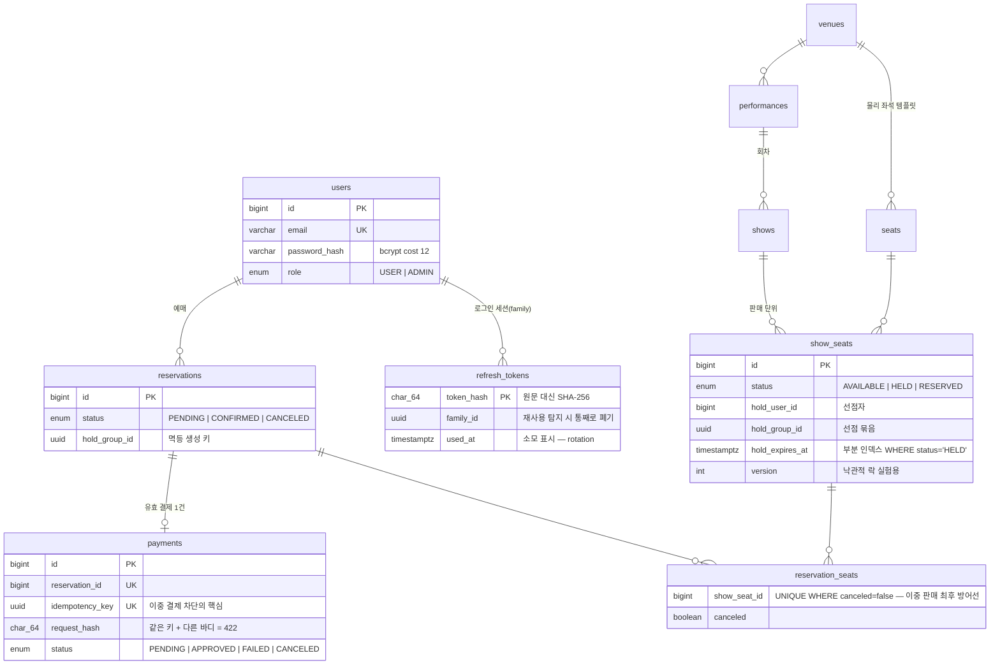
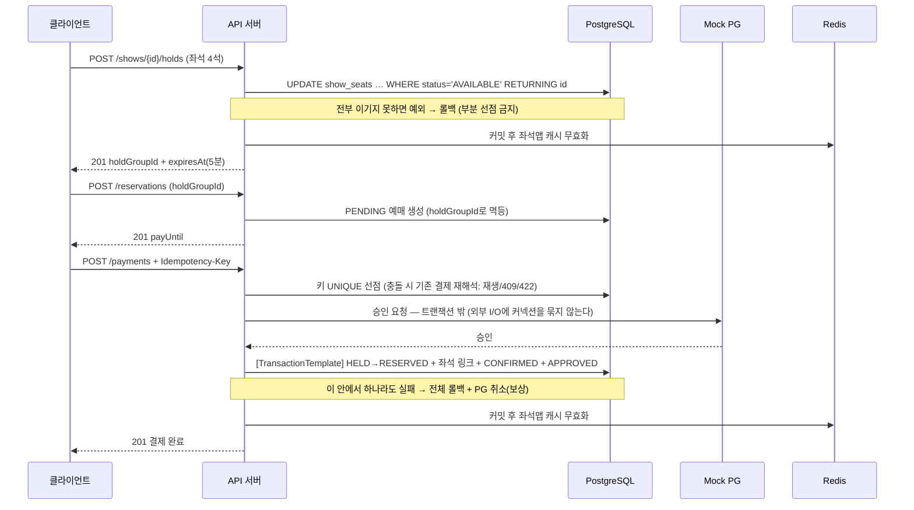

# SeatLock 아키텍처

> 좌석 선점형 예매 시스템의 구조와 핵심 설계 판단.
> "왜 이렇게 만들었는가"는 각 코드의 주석과 [기획서 §7](기획서.md)에, 락 전략 비교는 [lock-benchmark.md](lock-benchmark.md)에 있다.

## 전체 구성

```text
[브라우저 SPA (frontend/)]        [Swagger /docs]
        │ /api/*                        │
        ▼                               │
[nginx — SPA 서빙 + 리버스 프록시 + rate limit(20r/s)]
        │                               │
        ▼                               ▼
[API 서버 — Spring Boot 3 (backend/) · NestJS (backend-nest/, v2에서 동결)]
   │                    │
   ▼                    ▼
[PostgreSQL 16]      [Redis 7]
 · 진실의 원천        · 좌석맵 캐시 show:{id}:seatmap (TTL 5s)
 · 조건부 UPDATE      · 공연 목록 첫 페이지 (TTL 60s)
 · 부분 유니크 인덱스  · 판매 통계 (TTL 5m)
```

- **두 백엔드는 같은 API 계약을 구현한다.** NestJS(v1~v2)로 설계를 검증한 뒤 Spring(v3)으로 포팅했다. 도메인 규칙·SQL·트랜잭션 경계는 그대로, DI·ORM·미들웨어만 바뀐다.
- 스키마 원본은 Prisma 마이그레이션이며, Spring은 이를 스냅숏한 Flyway `V1__baseline.sql` + `ddl-auto: validate`로 소유권 충돌 없이 공존한다(DB는 분리).

## ERD



## 좌석 상태 기계 — 도메인의 중심

```text
                 조건부 UPDATE (원자적 선점)
  AVAILABLE ──────────────────────────────▶ HELD
      ▲                                      │
      │  ① lazy 판정(조회 시 만료면 AVAILABLE 취급)│ 결제 승인
      │  ② 스위퍼(30초 주기 회수)                │ (confirmByGroup)
      │  ③ 선점 해제/예매 취소                   ▼
      └────────────────────────────────── RESERVED
                   예매 취소(restoreReserved)
```

모든 전이는 **조건부 UPDATE 한 문장**이다 — `WHERE`에 기대 상태를 넣어 검사와 변경을 원자화한다.
경합 패자는 "0건 갱신"으로 판별되어 409를 받는다. 자세한 전략 비교는 [lock-benchmark.md](lock-benchmark.md).

## 예매 흐름과 트랜잭션 경계



핵심 경계 판단:

| 경계 | 판단 | 이유 |
|------|------|------|
| PG 호출 | 트랜잭션 **밖** | 외부 지연이 DB 커넥션 점유 시간으로 전이되는 것을 차단 |
| 승인 확정 | `TransactionTemplate` **안** | 좌석 확정·예매 확정·결제 기록은 전부-또는-전무 |
| 캐시 무효화 | **커밋 후** (`TransactionSynchronization`) | 커밋 전 무효화는 "옛 데이터 재캐싱" race를 만든다 |
| refresh 토큰 소모/폐기 | **독립 트랜잭션** | 재사용 탐지가 상위 예외로 롤백되면 탐지가 무효가 된다 |

## 선점 만료 — 3중 방어

| 층 | 메커니즘 | 역할 |
|----|---------|------|
| 1차 | 조회 시 lazy 판정 (`HELD && expires_at ≤ now` → AVAILABLE 취급) | 스케줄러 주기 사이의 공백 제거 |
| 2차 | 선점 시도 시 만료 좌석 인수 (조건부 UPDATE의 WHERE에 포함) | 죽은 선점이 판매를 막지 않게 |
| 3차 | 스위퍼 `@Scheduled` 30초 주기 일괄 회수 | 최종 권위 — DB 상태를 실제로 되돌린다 |

스위퍼의 UPDATE는 멱등이라 서버가 여러 대여도 안전하다(중복 실행 무해).

## 인증 — Refresh Rotation + 재사용 탐지

- Access 15분 / Refresh 14일, HS256. Refresh는 **원문 대신 SHA-256 해시**로 저장.
- 갱신 시마다 새 쌍 발급 + 이전 토큰 `used_at` 소모 표시(rotation).
- **소모된 토큰이 다시 오면 탈취로 판정** → 같은 `family_id`(로그인 단위) 전체 폐기.
- 소모/폐기는 독립 트랜잭션 — 이후 예외로 롤백되지 않아야 탐지가 성립한다.

## 모듈 맵 (Spring ↔ NestJS 대응)

| 도메인 | Spring (`backend/src/main/java/com/seatlock`) | NestJS (`backend-nest/src`) |
|--------|--------------------------------------------|------------------------------|
| 인증 | `auth/` (SecurityFilterChain + jjwt) | `auth/` (Guard + @nestjs/jwt) |
| 카탈로그 | `performance/`, `show/` | `performances/`, `shows/` |
| 선점 | `hold/` (`SeatStateRepository` = 조건부 UPDATE) | `holds/` ($queryRaw) |
| 예매 | `reservation/` | `reservations/` |
| 결제 | `payment/` (MockPgClient) | `payments/` |
| 캐시 | `common/cache/CacheClient` (커밋 후 무효화) | `redis/` |
| 에러 계약 | `common/error/` (code/message/details) | `common/errors/` |

같은 문제를 두 ORM에서 푼 지점: N+1(fetch join ↔ Prisma include), enum 바인딩, 트랜잭션 경계(@Transactional ↔ $transaction).

## 테스트 전략

- **통합 테스트가 본체** — 실제 PostgreSQL 16 + Redis 7 (Testcontainers). 조건부 UPDATE·부분 유니크 인덱스·`FOR UPDATE`는 인메모리 DB로 검증 불가.
- 동시성 테스트: 100 스레드 동시 선점 → **성공 정확히 1건** (프로젝트의 존재 증명).
- 결제 멱등 10 시나리오: 키 재생, 다른 바디 422, 동시 중복 409, PG 타임아웃 복구, 승인 중 만료 보상.
- CI(GitHub Actions)에서 전체 스위트 실행 — 초록 없이 머지 금지.
